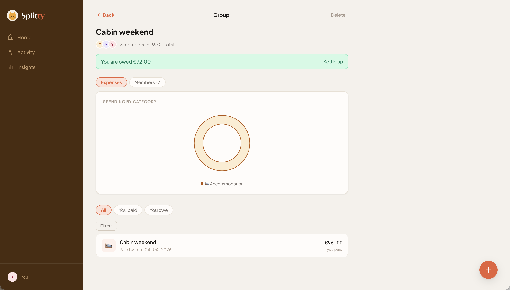
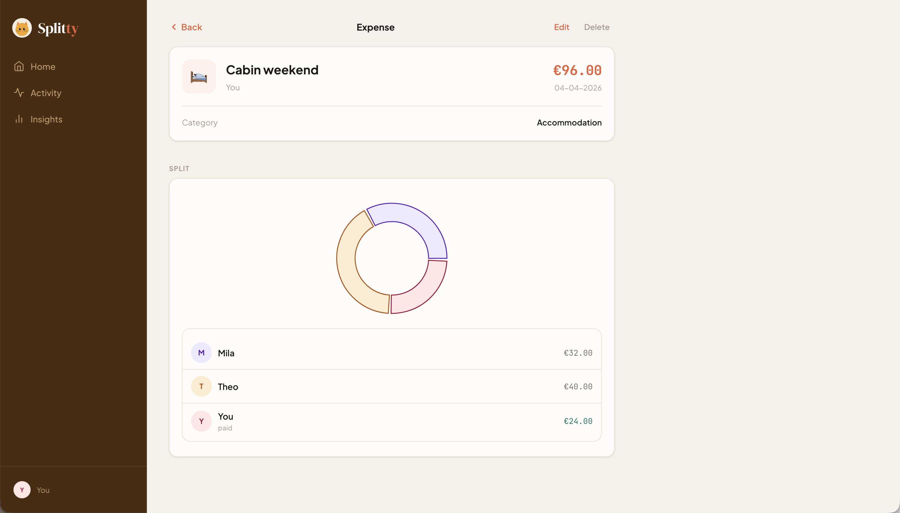

# Splitty

Splitwise, but the balances are a graph. A self-hosted expense-splitting app where debts aren't stored directly between people — they're derived from `PAID` and `OWED_BY` relationships on `Expense` nodes in Neo4j.

Built mostly as an excuse to get properly hands-on with graph data modeling.

**Live:** [splitty.jonasfiers.eu](https://splitty.jonasfiers.eu)




## How it's modeled

The obvious schema is `(:Person)-[:OWES {amount}]->(:Person)` — and it's a trap. Every new expense means finding, updating, or deleting edges between every pair involved, and the moment an update is missed, your balances silently drift from reality.

Instead, every expense is its own node, and nothing else is stored:

```cypher
MATCH (payer:User)-[:PAID]->(e:Expense)-[o:OWED_BY]->(u:User)
RETURN payer, e, o, u
```

You paid €96 for the cabin weekend; Mila owes €32, Theo owes €40. That's one `Expense` node, one `PAID` relationship in, two `OWED_BY` relationships out.

**Balances are derived, never stored.** What Mila owes you is summed on the fly from every `PAID`/`OWED_BY` pair across your shared groups. There's no balance field to keep in sync, so there's nothing to drift, and the full history of *why* a balance is what it is stays queryable.

**Settlements aren't a separate concept.** Paying someone back is just another `Expense` node (`isSettlement: true`) — the same traversal that computes balances handles them for free.

## Features

- Groups with multi-currency support and daily exchange-rate snapshots
- Expenses with hierarchical categories, arbitrary per-person shares, and settlements
- Balance transfers between groups
- Passkey (WebAuthn) and password login
- Push notifications for group activity
- Installable PWA with an offline-friendly service worker
- Animated cat avatar with an idle / success / fail state machine

## Stack

- **API** — Node.js, Express, Neo4j (`neo4j-driver` + APOC), JWT, WebAuthn, `web-push`, Nodemailer
- **Web** — React, Vite, React Router, Recharts
- **Infra** — Docker Compose, Nginx (public exposure is left to you — a host-level Cloudflare Tunnel, reverse proxy, etc.)

## Running it

### Full stack (Docker)

```bash
cp .env.example .env   # fill in the values
docker compose up -d --build
```

This brings up Neo4j, the API, and the web server — it doesn't expose anything to the internet. That's intentionally left to whatever you're already using on the host (Cloudflare Tunnel, a reverse proxy, etc.).

### Local dev

```bash
docker compose -f compose.dev.yaml up -d   # Neo4j only, exposed on bolt://localhost:7688
cp .env.example .env                        # set NEO4J_URI=bolt://localhost:7688 for local dev
npm install
npm run dev                                 # api on :3000, web on :5173
```

The web dev server proxies `/api` to the API — override the target with `VITE_API_TARGET` if it's not running at `http://api:3000`.

## Backups

Neo4j Community Edition doesn't support online (zero-downtime) backups — that's an Enterprise-only feature. `scripts/backup-neo4j.sh` briefly stops the `neo4j` container, tars up the `neo4j_data` volume, and starts it back up. Assumes the stack lives at `/opt/splitty` and the volume is named `splitty_neo4j_data`; adjust if yours differs.

Run nightly via cron, logging output so failures don't go unnoticed:

```
0 3 * * * /opt/splitty/scripts/backup-neo4j.sh >> /var/log/neo4j-backup.log 2>&1
```

Backups older than 14 days are pruned automatically. This only protects against data loss, not host loss — the tarballs land on the same machine, so copying them elsewhere is left as an exercise for whoever's reading this.

## License

MIT — see [LICENSE](LICENSE).

---

Built by [Jonas Fiers](https://www.jonasfiers.eu) — software engineer in Ghent, usually somewhere between low-code platforms and graph databases.
